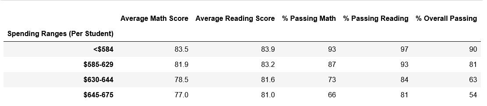

# School_District_Analysis

## Overview of the Project
We were asked to analyze School District Data using Python and Pandas. Once we finished the initial analysis, we were informed that the 9th graders from Thomas High School (THS) ended up cheating. We were asked to remove them from the analysis and perform the analysis again.

## Summary of Results

- When we replaced the THS 9th graders scores with NaN's, in the district analysis, we see a drop in percentaged throughout the board, with the average reading scores staying the same. (See District Summary below)
- Since all the changes we are making are to THS, the changes we see in the School Summary are to the statistics related to THS. (See School Summary below)
- Removing the 9th graders in THS, we see THS stay in second place on the top 5 schools, but has its percentages slightly reduced. (See Top School below) 
- How does replacing the ninth-grade scores affect the following:
  - Math and reading scores have a NaN in the value for the THS 9th graders. (See Math and Reading Scores)
  - Scores by school spending is not affected. (See Performance by Spending below)
  - Scores by school size is not affected. (See Performance by Size below)
  - Scores by school type is not affected. (See Performance by Type below)

#### Old District Summary

#### District Summary

#### School Summary

#### Top Schools

#### Math and Reading Scores

#### Performance by Spending

#### Performance by Size

#### Performance by Type

## Summary

When we replace the 9th grade students at THS, we see some of the following changes. The first change that we see is that we have slightly reduced percentages in the district analysis. The second change that we see is that THS performes slightly worse on the School Summary. The third change that we see is that will be seeing NaN's on the math and reading scores by grade. The fourth change that we see are the slightly lower statistics on the Top Schools chart. We get slightly worse performance with THS when we update the grades and in turn it has a slight effect on all the charts, however, because the change is not that large, we dont see the change in performance charts because the changes are smaller than the precision we are measuring to.
